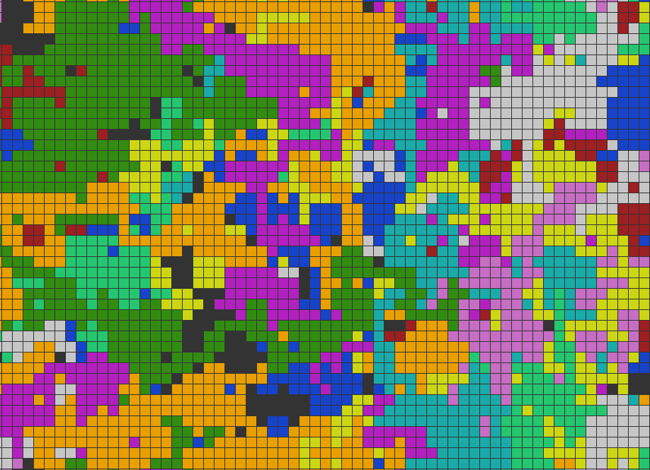

##Random Walk

Generates walkers that traverses the screen indefinitely, partaking in what is
commonly known as "The Drunkard's Walk." Each walker has an equal probability
of going North, South, East, or West for each step. Edges are set to be wrap
around. 

Table structure first found here and borrowed due to cleverness, checkout his
"Game of Life":
https://github.com/wrr/game-of-life-js/blob/master/life.js

Other than the table stucture, the rest of the code is mine and was an attempt
to:

1. Learn how to pass lots of objects into various other objects

2. Learn how to animate in Javascript

3. Make Pretty colors move

4. Add the abiliy for a user to add or remove objects and control aspects of
   the object.

Menu on the top left allows the ability to create different colored walkers,
remove the oldest walkers, and clear the screen.

Enjoy.

